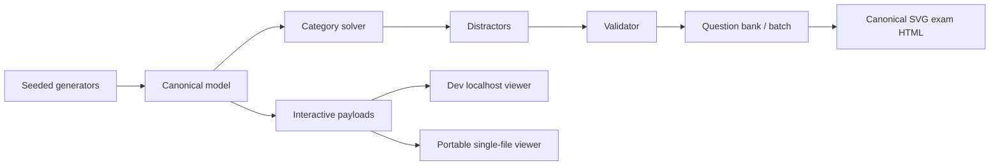

# ManipAT

**ManipAT** is a deterministic, geometry-first generator for original DAT Perceptual Ability Test (PAT) practice questions.

It generates all six PAT categories from mathematical/discrete ground-truth models, solves them automatically, builds controlled distractors, validates every accepted question, renders printable SVG-based exam material, and provides interactive learning views for 3D and Paper Punching questions.

> ManipAT is an independent practice-content generator and engineering project. It is not an official DAT product and is not affiliated with the American Dental Association or any test administrator.

## What it can generate

| Category | CLI name | Default full-set count | Interactive learning view |
|---|---|---:|---|
| Apertures / Keyhole | `aperture` | 15 | Three.js 3D |
| View Recognition / TFE | `view-recognition` | 15 | Three.js 3D |
| Angle Discrimination | `angle` | 15 | canonical 2D SVG |
| Paper Folding / Hole Punching | `paper-folding` | 15 | guided SVG + fold/unfold animation |
| Cube Counting | `cube-counting` | 15 | Three.js voxel view |
| Spatial Relations / Form Development | `form-development` | 15 | Three.js folded-solid view |

The default profile produces a **90-question PAT set** with 15 questions per category.

## Why ManipAT is different

ManipAT does not generate a picture first and then guess its answer. The architecture is:

```text
seed + difficulty
      ↓
canonical geometry/state model
      ↓
mathematical solver
      ↓
correct answer
      ↓
controlled distractors
      ↓
independent validator
      ↓
SVG printable exam + optional interactive learning views
```

That makes the engine:

- **deterministic** — questions are reproducible from seeds;
- **geometry-first** — rendered pixels are never the source of truth;
- **automatically solvable** — every question originates from a model the engine can solve;
- **automatically validated** — ambiguous/degenerate questions are rejected;
- **offline-first** — generation and both viewer modes require no internet access;
- **printable** — canonical output is self-contained Letter-sized HTML with embedded SVG;
- **interactive** — 3D objects can be explored and Paper Punching can be studied step-by-step/animated;
- **inspectable** — questions retain recipes, fingerprints, difficulty components, validation, and structured explanation data.

## Requirements

- Node.js **22+**
- pnpm **10.x** (`pnpm@10.15.1` is declared by the repository)

```bash
corepack enable
corepack prepare pnpm@10.15.1 --activate
pnpm install
pnpm build
```

Check the environment:

```bash
pnpm dat doctor
```

## Quick start

Generate a complete 90-question set:

```bash
pnpm dat generate set \
  --workers 3 \
  --seed exam-001 \
  --difficulty 3 \
  --offline \
  --output ./output/exam-001.html
```

Open the generated file in a browser and print it directly or use **Save as PDF**.

Validate all embedded questions:

```bash
pnpm dat validate ./output/exam-001.html
```

## Interactive viewer modes

ManipAT intentionally supports two runtime delivery modes that use the same canonical persisted questions and the same renderer code.

### Development / debug mode

```bash
pnpm dat:view ./output/exam-001.html
```

or explicitly:

```bash
pnpm dat:view:dev ./output/exam-001.html
```

Then open:

```text
http://127.0.0.1:4173/
```

Use this mode while developing/debugging. Three.js, OrbitControls, and ManipAT runtime modules remain ordinary files served from localhost, which makes source-level browser debugging straightforward.

### Portable viewer

```bash
pnpm dat:view:portable ./output/exam-001.html
```

This writes:

```text
./output/exam-001.interactive.html
```

Open that HTML file directly from Finder/Explorer or with your browser. After it has been generated, **no Node.js process, localhost server, CDN, or network connection is required**. The compiled ManipAT runtime, Three.js, OrbitControls, and selected question payloads are embedded in the file.

Choose a different output name:

```bash
pnpm dat:view:portable ./output/exam-001.html \
  --output ./output/exam-001-shareable.html
```

Both viewer modes support category/question selection:

```bash
# Development/debug
pnpm dat:view ./output/exam-001.html --category aperture
pnpm dat:view ./output/exam-001.html --category tfe
pnpm dat:view ./output/exam-001.html --category paper
pnpm dat:view ./output/exam-001.html --category cubes
pnpm dat:view ./output/exam-001.html --category form

# Portable
pnpm dat:view:portable ./output/exam-001.html --category aperture
pnpm dat:view:portable ./output/exam-001.html --question-id <question-id>
```

Development-only reconstruction check:

```bash
pnpm dat:view ./output/exam-001.html --category aperture --dry-run
```

See:

- [Interactive Three.js Runtime](docs/THREE_RUNTIME.md)
- [Portable Interactive Viewer](docs/PORTABLE_VIEWER.md)
- [Interactive Learning Modes](docs/INTERACTIVE_LEARNING.md)

## Viewer capabilities

Where applicable, the interactive viewer provides:

- mouse/touch orbit, pan and zoom;
- 3D/front/top/end camera presets;
- target view;
- reset and auto-rotate;
- Surface and Edges toggles;
- Ghost / dashed hidden-line mode;
- semantic Color Code learning cues for mesh questions;
- Cube Counting explanation highlighting;
- Paper Punching all-steps overview plus forward/reverse/rewind animation;
- category filtering and exam-level Previous/Next/question navigation.

These views are learning/debugging surfaces only. They never determine answer truth.

## Generate one category

```bash
pnpm dat generate category aperture \
  --count 10 \
  --difficulty 5 \
  --seed aperture-hard-001 \
  --offline \
  --output ./output/aperture-hard-001.html
```

Inspect the structured data and SVG assets behind a generated question:

```bash
pnpm dat inspect ./output/exam-001.html \
  --output ./output/exam-001-inspect.html
```

## Difficulty

Five requested bands are available:

```text
1  beginner
2  easy
3  medium
4  hard
5  expert
```

Use a fixed band:

```bash
--difficulty 4
```

A range:

```bash
--difficulty 2-4
```

Or an exact weighted mix:

```bash
--difficulty-mix 1:1,2:2,3:4,4:2,5:1
```

Difficulty changes actual source-question parameters such as model complexity, angle separation, fold count, projection information, voxel structure, and distractor geometry. It is not merely a label.

See the [User Guide](docs/USER_GUIDE.md#7-difficulty-control) for per-category difficulty overrides and config-file examples.

## Useful commands

```bash
# List public category names
pnpm dat list categories

# List difficulty names
pnpm dat list difficulties

# Generate the default full set
pnpm dat generate set --seed exam-001 --offline --output ./output/exam-001.html

# Generate one category
pnpm dat generate category tfe --count 10 --difficulty 4 --seed tfe-001 --offline --output ./output/tfe-001.html

# Generate selected categories
pnpm dat generate categories --categories aperture,tfe,paper --count 5 --difficulty 3 --seed mixed-001 --offline --output ./output/mixed-001.html

# Validate generated/persisted questions
pnpm dat validate ./output/exam-001.html

# Inspect question assets and metadata
pnpm dat inspect ./output/exam-001.html --output ./output/inspect.html

# Development/debug interactive viewer
pnpm dat:view:dev ./output/exam-001.html

# Portable single-file interactive viewer
pnpm dat:view:portable ./output/exam-001.html

# Verify runtime reconstruction without starting WebGL
pnpm dat:view ./output/exam-001.html --category aperture --dry-run

# Reproduce a candidate from seed/type
pnpm dat regenerate --type aperture --seed debug-seed --difficulty 5

# Run runtime checks
pnpm dat doctor

# Run generation benchmark
pnpm dat benchmark
```

## Output artifacts

ManipAT now deliberately separates three concerns.

### Canonical printable exam

`pnpm dat generate ...`

Produces a standalone HTML exam containing:

- cover page;
- section directions;
- deterministic page layout;
- embedded prompt/choice SVGs;
- embedded canonical question JSON;
- shared Cube Counting figures;
- answer sheet;
- Letter portrait print CSS;
- no external scripts, stylesheets, images, or fonts.

This artifact is authoritative for scored presentation and printing/PDF.

### Development/debug runtime

`pnpm dat:view` / `pnpm dat:view:dev`

Runs a localhost module server for fast browser iteration and source-level debugging.

### Portable interactive runtime

`pnpm dat:view:portable`

Produces a separate `.interactive.html` companion with the interactive runtime embedded as data-URL ES modules. It can be opened directly from the filesystem and shared as one file.

The printable exam intentionally remains script-free; portable interactivity does not compromise print fidelity.

## Architecture at a glance

ManipAT uses a hybrid stack because the six PAT tasks have different mathematical truth models.



- **Manifold** — robust 3D CSG, projection, mesh/cross-section truth for Aperture/TFE.
- **Custom discrete/2D models** — Paper Folding, Cube Counting, Angles, Form Development semantics.
- **Custom SVG** — canonical printable PAT line art.
- **Three.js** — interactive/runtime visualization for Aperture, TFE, Cube Counting and Form Development; never answer truth.
- **Paper guided runtime** — canonical discrete fold state rendered as overview, step states and fold/unfold animation.
- **Question bank** — unified API, deduplication, difficulty scheduling, workers, persistence, full-exam assembly.

For the detailed algorithms and engineering history, read [`docs/DESIGN.md`](docs/DESIGN.md).

## Workspace map

```text
packages/core                  deterministic PRNG, math, serialization, shared types
packages/geometry              Manifold wrapper, topology, projection, silhouettes
packages/object-generator      procedural Aperture/TFE 3D template banks
packages/svg                   deterministic SVG construction
packages/renderer-three        interactive/runtime Three.js payloads, scenes and browser host
packages/pat-aperture          Aperture generator/solver/validator/renderer
packages/pat-view-recognition  TFE generator/solver/validator/renderer
packages/pat-angle             Angle generator/solver/validator/renderer
packages/pat-paper-folding     fold-state engine, solver, renderer, validator
packages/pat-cube-counting     voxel generator/solver/renderer/validator
packages/pat-form-development  polyhedra, nets, solver, renderer, validator
packages/question-bank         unified engine, batch/workers, persistence, exam HTML
packages/cli                   generation CLI, dev viewer server, portable viewer packer
```

## Quality and verification

The repository uses strict TypeScript, ESLint with zero-warning builds, deterministic fuzz/stress tests, golden fixtures, and a GitHub Actions verification workflow.

Coverage includes high-volume generation tests for all six PAT categories, geometry/projection regressions, persistence/determinism, full CLI workflows, Three.js runtime behavior, Paper learning views, and portable-module packaging.

CI also generates:

- a complete 90-question offline set with worker threads; and
- difficulty-5 smoke sets for all six categories.

Run the same core checks locally:

```bash
pnpm build
pnpm lint
pnpm test
```

For geometry/rendering changes, also generate fixed-seed HTML and review it visually at print scale. For interactive changes, compare both `pnpm dat:view:dev` and `pnpm dat:view:portable` in a real browser. Mathematical validity alone cannot catch every WebGL/interaction defect.

## Documentation

Start with the document that matches what you are doing:

- **[User Guide](docs/USER_GUIDE.md)** — installation, full CLI reference, generation recipes, difficulty, profiles/config, validation, inspection, printing, troubleshooting.
- **[Interactive Three.js Runtime](docs/THREE_RUNTIME.md)** — runtime controls, reconstruction model, browser API and resource ownership.
- **[Portable Interactive Viewer](docs/PORTABLE_VIEWER.md)** — dev vs portable modes, self-contained module packaging, CLI usage, validation checklist.
- **[Interactive Learning Modes](docs/INTERACTIVE_LEARNING.md)** — Color Code, Cube inspection controls and Paper Punching guided explanation/animation.
- **[Design & Implementation](docs/DESIGN.md)** — current architecture, geometry/projection algorithms, all six category implementations, major challenges/fixes, testing strategy, tradeoffs, and future roadmap.
- **[Original Implementation Specification](docs/dev/implementation_spec.md)** — detailed target specification used to guide construction.
- **[PAT Format/Layout Specification](docs/dev/DAT_PAT_90Q_Format_Layout_AI_Agent_Spec.md)** — PAT format and layout research.
- **[Research Reference](docs/dev/pat_research_reference.md)** — supporting research/reference material.

## Development principle

The central rule for future work is:

> **Generate a model that can be solved exactly, validate it independently, and only then make it look like an exam question.**

That separation is what allows ManipAT to improve visual fidelity, interactivity, portability, and performance without sacrificing mathematical correctness.
