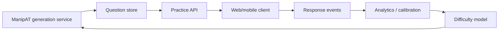

# ManipAT Design and Implementation

**Status:** current-state architecture and engineering record  
**Project:** ManipAT — deterministic DAT Perceptual Ability Test generator  
**Runtime:** TypeScript / Node.js 22+ / ESM / pnpm workspace  
**Geometry kernel:** Manifold (`manifold-3d`)  
**Interactive runtime rendering:** Three.js  
**Canonical exam rendering:** custom SVG  

This document describes **what ManipAT actually implements today**, why the architecture is structured this way, the algorithms behind the six PAT categories, the major engineering problems encountered during implementation, the fixes that stabilized the system, and the highest-value future improvements.

It complements rather than replaces the original planning material in [`docs/dev/`](dev/). In particular:

- [`dev/implementation_spec.md`](dev/implementation_spec.md) is the original implementation specification and target architecture;
- [`dev/DAT_PAT_90Q_Format_Layout_AI_Agent_Spec.md`](dev/DAT_PAT_90Q_Format_Layout_AI_Agent_Spec.md) records PAT format/layout research;
- [`USER_GUIDE.md`](USER_GUIDE.md) is the practical CLI/operator guide.

If this document and the executable code disagree, **the current code and tests are authoritative**. Architecture documentation should be updated in the same change that materially changes behavior.

---

# 1. Executive Summary

ManipAT is a **geometry-first procedural question generator** for all six DAT PAT question families:

1. Apertures / Keyhole
2. View Recognition / TFE
3. Angle Discrimination
4. Paper Folding
5. Cube Counting
6. Spatial Relations / Form Development

The central architectural decision is that **rendered pixels are never the source of truth**. Every question begins with a canonical mathematical or discrete model. A category-specific solver derives the answer. Distractors are generated as controlled semantic or geometric mutations. A validator independently rechecks the question. Rendering happens only after truth has already been established.

The core pipeline is:

```text
seed + requested difficulty
            │
            ▼
   deterministic generator
            │
            ▼
 canonical geometry/state model
            │
            ▼
  category-specific solver
            │
            ▼
 mathematically correct answer
            │
            ▼
 controlled distractor generation
            │
            ▼
 independent validator
            │
            ▼
 difficulty + fingerprints + metadata
            │
            ▼
 SVG / Three.js representation
            │
            ▼
 standalone HTML / persisted question data
```

This separation gives ManipAT several useful properties:

- **Determinism:** the same seed/configuration and code revision reproduce the same accepted material.
- **Automatic solvability:** questions are created from models the software itself can solve.
- **Automatic rejection:** ambiguous, degenerate, duplicate, or structurally invalid candidates can be discarded before publication.
- **Explainability:** structured geometry/state metadata can support explanations without reverse-engineering an image.
- **Testability:** mathematical invariants can be fuzz-tested across thousands of seeds.
- **Renderer independence:** SVG or interactive visualization can change without changing ground truth.

The system intentionally uses a **hybrid geometry stack** rather than forcing one library to solve every PAT category:

- **Manifold** provides robust 3D solid geometry and 2D cross-sections for Aperture/TFE object generation and shared geometry utilities.
- **Custom 2D/discrete models** handle Paper Folding, Cube Counting, Angle Discrimination, and Form Development where semantic state is more important than CSG.
- **Custom SVG** provides precise printable exam line art.
- **Three.js** provides optional interactive/runtime visualization, not mathematical truth.

---

# 2. Product and Engineering Goals

## 2.1 Primary goals

ManipAT is designed to:

- generate original PAT-style practice questions rather than reproduce a proprietary bank;
- support complete 90-question sets and category-specific practice;
- work offline;
- generate deterministic output from explicit seeds;
- support five engineering difficulty bands;
- provide unique, automatically validated answers;
- preserve enough semantic metadata to explain why an answer is correct;
- create compact vector artwork appropriate for print;
- scale to large seeded fuzz corpora and batch generation;
- remain modular enough that category algorithms can evolve independently.

## 2.2 Non-goals of the current engine

The current codebase is not intended to be:

- a full LMS;
- an authentication/payment system;
- a student analytics platform;
- an empirically calibrated adaptive-learning model;
- a direct clone of any copyrighted question bank;
- a photorealistic CAD renderer;
- a pixel-based computer-vision solver;
- a direct PDF generation system.

Those can be built around the engine later without weakening the geometry-first core.

---

# 3. Architectural Invariants

Several rules should be treated as architectural constraints, not implementation preferences.

## 3.1 Ground truth comes before rendering

A renderer may illustrate a correct model, but it must never decide what the correct answer is.

Bad architecture:

```text
render image → inspect image/pixels → infer correct answer
```

ManipAT architecture:

```text
model → solve model → establish correct answer → render model
```

This rule is especially important for:

- hidden lines in TFE;
- silhouettes in Aperture;
- fold reflections in Paper Folding;
- painted-face counts in Cube Counting;
- foldable net topology in Spatial Relations.

## 3.2 Every accepted question has exactly one answer

Distractors are not merely different-looking drawings. They must be structurally distinct from the correct answer and from one another according to category-specific fingerprints or semantic comparison.

The validator, not the generator, is the final authority on whether the answer remains unique.

## 3.3 Randomness is explicit and deterministic

Generation code must not use ambient randomness such as `Math.random()`.

All random choices originate from a seeded `RandomSource`, and subcomponents use deterministic namespace forks. This prevents the common procedural-generation failure where adding one random draw near the beginning silently changes every downstream choice.

## 3.4 Geometry ownership is explicit

Manifold objects wrap WebAssembly resources. Handles are owned by a particular geometry kernel and expose `dispose()` / `Symbol.dispose` semantics.

Temporary solids/sections are normally managed with `using` so intermediate CSG objects are released predictably.

## 3.5 Offline means offline

The generation pipeline has no network requirement. CLI `--offline` replaces `globalThis.fetch` with a rejecting guard, making accidental network dependencies fail immediately.

## 3.6 Visual fidelity is an acceptance layer, not a substitute for mathematical validity

A question can be mathematically valid and still be poor practice material because:

- hidden lines are visually noisy;
- line endpoints nearly meet but leave a gap;
- a folded solid looks open;
- a Paper Folding diagram merges away a folded flap;
- a feature is too small at print scale;
- a distractor is technically different but visually trivial.

Therefore ManipAT uses both:

1. automated mathematical/structural validation; and
2. fixed-seed visual review/golden references.

---

# 4. Repository Architecture

The repository is a TypeScript monorepo.

```text
manipat/
├── packages/
│   ├── core/
│   ├── geometry/
│   ├── object-generator/
│   ├── svg/
│   ├── renderer-three/
│   ├── pat-aperture/
│   ├── pat-view-recognition/
│   ├── pat-angle/
│   ├── pat-paper-folding/
│   ├── pat-cube-counting/
│   ├── pat-form-development/
│   ├── question-bank/
│   └── cli/
├── profiles/
├── fixtures/
├── test/
├── docs/
└── .github/workflows/
```

## 4.1 `@manipat/core`

Provides category-independent primitives:

- vector types and vector math;
- tolerance constants;
- seeded random-source interface;
- Xoshiro128** implementation;
- deterministic `fork(namespace)` behavior;
- canonical JSON serialization;
- fingerprints;
- shared question/validation types.

This package should remain small and dependency-light.

## 4.2 `@manipat/geometry`

Provides the shared geometry abstraction:

- Manifold kernel wrapper;
- owned solid and cross-section handles;
- primitives and CSG operations;
- transforms;
- solid normalization;
- canonical mesh extraction;
- logical topology/edge extraction;
- orthographic projection;
- silhouette canonicalization;
- geometry-quality validation.

The geometry package is intentionally independent of PAT semantics.

## 4.3 `@manipat/object-generator`

Contains reusable procedural 3D template families for Aperture and TFE.

Templates instantiate solids from:

- a geometry kernel;
- a seed;
- a deterministic random source.

They return geometry plus recipe/provenance information so downstream code can retain semantic feature history.

The model bank contains both foundation families and more complex golden-style families used at higher difficulty.

## 4.4 `@manipat/svg`

Small SVG construction layer for:

- documents;
- polygons;
- lines;
- circles;
- paths and related attributes.

SVG is treated as output data, not as a scene graph that determines truth.

## 4.5 `@manipat/renderer-three`

Provides runtime Three.js adapters and interactive preview utilities:

- Manifold mesh → `BufferGeometry` conversion;
- orthographic/isometric cameras;
- surface/edge materials;
- selectable/highlightable pictorial previews;
- projection planes;
- instanced cube rendering;
- explicit Three.js geometry/material disposal.

The CLI's printable PAT output does not depend on WebGL.

## 4.6 `@manipat/pat-*`

Each PAT category package owns its own:

- domain types;
- generator;
- solver;
- validator;
- renderer;
- distractor logic where applicable;
- tests.

This is a deliberate anti-abstraction decision. Although all categories share a common question envelope, the reasoning rules of Paper Folding and TFE are fundamentally different. Forcing them through one generic solver would obscure correctness.

## 4.7 `@manipat/question-bank`

Integrates all categories into one engine and batch system:

- `PatEngine` dispatch;
- unified generation API;
- validation dispatch;
- duplicate detection;
- difficulty scheduling;
- exact weighted difficulty quotas;
- worker-thread generation;
- serialization/persistence;
- standalone HTML exam rendering;
- asset extraction.

## 4.8 `@manipat/cli`

Provides the offline command-line product surface:

```text
generate
validate
inspect
regenerate
benchmark
doctor
list
```

See [`USER_GUIDE.md`](USER_GUIDE.md) for practical usage.

---

# 5. Determinism and Reproducibility

## 5.1 Seeded PRNG

ManipAT uses a Xoshiro128** random generator initialized from a hashed string seed.

Important characteristics:

- the seed must be non-empty;
- `next()` returns deterministic uniform values in `[0, 1)`;
- integer generation uses rejection sampling to avoid modulo bias;
- `shuffle()` uses deterministic Fisher-Yates behavior;
- `fork(namespace)` derives a new generator from the immutable root seed plus namespace.

Example conceptual pattern:

```ts
const random = createRandomSource(seed);
const template = random.fork("template").pick(templates);
const parameters = random.fork("parameters");
const choices = random.fork("choice-order").shuffle(rawChoices);
```

This is preferable to consuming one long PRNG stream because template implementation changes do not need to perturb unrelated choice ordering.

## 5.2 Candidate seeds in batch generation

Batch generation derives candidate seeds as:

```text
<root-seed>:<category>:<attempt-index>
```

Rejected candidates therefore do not introduce nondeterministic reseeding.

## 5.3 Canonical serialization

Canonical JSON recursively sorts object keys and rejects:

- non-finite numbers;
- cyclic structures;
- unsupported values;
- non-plain objects.

Fingerprints are generated from canonicalized data rather than arbitrary JavaScript object insertion order.

## 5.4 Reproducibility boundary

ManipAT aims for byte-stable results for the same inputs **within a code revision**.

An intentional geometry algorithm, template, renderer, or serialization change may alter fingerprints or SVG output. Therefore long-lived regression artifacts should record the Git commit as well as the seed.

---

# 6. Geometry Kernel Design

## 6.1 Why Manifold

Aperture and TFE require robust constructive solid geometry. Manifold is used because it provides:

- closed manifold solids;
- robust Boolean operations;
- primitives;
- extrusion/revolution;
- transforms;
- cross-section projection;
- mesh extraction;
- WebAssembly availability under Node/browser environments.

The rest of ManipAT talks to a `GeometryKernel` interface rather than importing Manifold implementation details everywhere.

## 6.2 Owned handles

`SolidHandle` and `SectionHandle` wrap Manifold objects and track:

- owner kernel;
- disposal state.

Using a handle from a different kernel throws. Using a disposed handle throws.

This prevents subtle cross-context errors when worker threads create independent Manifold contexts.

## 6.3 Normalization

Procedural objects vary in dimensions and coordinate location. Before projection, solids are normalized to a stable scale/position so:

- rendering is consistent;
- tolerances operate over a predictable numerical range;
- silhouettes are comparable;
- view boxes remain reasonable.

Normalization returns both the normalized solid and transform metadata for provenance/debugging.

## 6.4 Geometry-quality validation

Generated solids are rejected when they are empty, invalid, non-finite, or otherwise unusable.

A key lesson from implementation was that **valid high-level CSG can still contain degenerate mesh triangles**. Those triangles are triangulation artifacts rather than meaningful topological faces. Logical topology extraction therefore skips zero-area/degenerate triangles instead of attempting to normalize a zero vector and crashing.

---

# 7. Coordinate and Projection Conventions

The canonical 3D convention used by the projection layer is:

```text
+X  right
+Y  depth/back
+Z  up
```

TFE frames are explicit:

## Front

Camera looks along `-Y`:

```text
viewDirection = [0, -1, 0]
imageRight    = [1,  0, 0]
imageUp       = [0,  0, 1]
```

## Top

Camera looks along `-Z`:

```text
viewDirection = [0, 0, -1]
imageRight    = [1, 0,  0]
imageUp       = [0, 1,  0]
```

## Right end

Camera is at `+X` looking toward the origin:

```text
viewDirection = [-1, 0, 0]
imageRight    = [ 0, 1, 0]
imageUp       = [ 0, 0, 1]
```

Encoding these frames as data rather than scattered camera transforms was important for consistent TFE correspondence.

---

# 8. Logical Topology and Orthographic Line Extraction

TFE and the Aperture pictorial renderer need clean logical edges rather than raw triangle-wireframe output.

## 8.1 Why raw mesh edges are wrong

CSG output is triangulated. A cylinder may contain many artificial facet or triangulation edges that are not intended to appear as PAT line art.

Drawing every mesh edge causes:

- diagonal triangulation lines on planar faces;
- excessive cylinder facets;
- unreadable hidden-line clutter;
- poor resemblance to exam drawings.

ManipAT therefore reconstructs **logical faces and logical edges** from mesh adjacency and normals.

## 8.2 Degenerate triangle handling

During the full-codebase audit, certain Manifold outputs exposed zero-area triangles. Attempting to normalize their face normal caused failures.

Current behavior:

1. compute triangle area/normal magnitude;
2. skip degenerate triangles as non-topological artifacts;
3. build logical adjacency from remaining valid faces.

This is safer than manufacturing an arbitrary normal.

## 8.3 Display crease filtering

Even valid triangulated curved surfaces can expose shallow facet creases.

`createOrthographicView()` supports `displayCreaseAngleDegrees`.

In midpoint line-art mode, the default is approximately **32°**. An edge below this threshold is suppressed unless adjacent faces straddle the camera direction and therefore form a true view silhouette.

This was chosen specifically to remove artificial creases from common 12-sided cylinder approximations, where adjacent side facets meet around 30°, while retaining true rims, silhouettes, and normal chamfers.

This is a rendering heuristic, not a declaration that all sub-32° geometry is semantically smooth. Future surface provenance can improve this further.

## 8.4 Visibility testing

Each logical edge is subdivided and classified by ray visibility.

For a sample point:

1. project the point into the view plane;
2. create a ray from in front of the object toward that point;
3. test whether another triangle intersects before the target point;
4. classify the sample as visible or hidden.

## 8.5 Projected triangle grid acceleration

The first exact implementation tested every sample ray against essentially every triangle. That became the dominant cost for hard Aperture models.

The current implementation creates a projected spatial grid:

1. precompute projected AABBs for triangles;
2. build an adaptive grid, bounded roughly between 4×4 and 32×32;
3. register each triangle only in cells overlapped by its projected AABB;
4. map each visibility sample to one cell;
5. ray-test only triangles registered in that cell;
6. retain the exact ray/triangle intersection as the final test.

This preserves correctness while greatly reducing candidate intersection tests.

## 8.6 Visibility-transition refinement

A previous implementation independently classified fixed edge fragments. At a visible/hidden transition, neighboring fragments could terminate at slightly different locations, producing:

- tiny gaps;
- endpoints that nearly met;
- lines that protruded past an occluder.

Current midpoint mode:

1. classifies subdivision midpoints;
2. detects adjacent samples with different visibility states;
3. binary-searches the transition interval;
4. uses one shared refined boundary;
5. emits contiguous runs.

This greatly improves printed line joins.

## 8.7 Collinear merging

Projection creates many small fragments. These are canonicalized and merged into longer lines.

The original merge approach repeatedly scanned/spliced pairs and scaled poorly with heavily fragmented edges.

The current approach:

- snaps/canonicalizes endpoints;
- builds endpoint → segment adjacency;
- traverses connected collinear components;
- collapses each component to its extreme endpoints;
- deduplicates the result.

This turns large fragment sets into clean logical strokes without cubic-ish repeated rescanning.

## 8.8 Hidden-line cleanup

After visible and hidden merging, a hidden segment whose endpoints both lie on the same visible segment is removed. This avoids drawing a dashed duplicate underneath an already visible stroke.

---

# 9. SVG Rendering Architecture

The custom SVG layer produces deterministic strings with explicit view boxes, semantic titles/descriptions, and vector primitives.

Reasons for custom SVG rather than using a general 3D SVG renderer:

- precise control over solid vs dashed strokes;
- predictable print widths;
- no dependency on camera rasterization;
- stable fingerprints/snapshots;
- accessibility labels;
- compact standalone HTML output;
- category-specific grammar such as Paper Folding reference outlines.

The SVG layer is intentionally simple. Higher-level PAT packages decide what should be drawn.

---

# 10. Three.js Runtime Rendering

Three.js is used where interactive 3D behavior is useful, but it is not involved in determining answers.

`renderer-three` supports:

- isometric orthographic preview cameras;
- surface meshes;
- edge overlays;
- ghosting;
- triangle/feature highlighting;
- projection planes;
- instanced cube visualization.

Every owned renderer object provides explicit disposal. Surface geometry, edge geometry, materials, highlight meshes, and projection planes are released to avoid long-running browser/tool memory leaks.

---

# 11. Aperture / Keyhole Design

## 11.1 Problem model

An Aperture question needs:

- a 3D object shown pictorially;
- a direction/orientation in which its orthographic silhouette defines a valid passage opening;
- one exact silhouette choice;
- several plausible but invalid openings.

The truth is the **2D orthographic projection of the solid**, not the visible outline of the pictorial drawing.

## 11.2 Object generation

The generator selects from multiple procedural template banks.

Difficulty affects template selection:

- lower bands include foundation/rich objects;
- middle bands increasingly weight complex families;
- bands 4–5 use the advanced model bank.

Advanced templates combine multiple semantic features such as:

- stepped/tiered prisms;
- cylindrical components;
- recesses and pockets;
- tapered/faceted crowns;
- rails/tabs;
- bridge/fork forms;
- mixed prism-cylinder compositions.

The purpose of the advanced bank is **model complexity**, not merely more complicated answer distractors.

## 11.3 Normalization and principal projections

After geometry-quality validation, the source solid is normalized.

ManipAT evaluates principal orientations corresponding to rotations that expose different dimensions. Duplicate silhouette fingerprints are removed.

A projection-complexity metric considers properties such as:

- polygon vertex count;
- concavities;
- additional polygons/holes.

Higher difficulty requests higher minimum projection complexity. If no projection meets the threshold, the most complex principal projection is used rather than failing immediately.

## 11.4 Pictorial view

The object prompt uses a fixed isometric-style frame rather than a random camera.

A stable camera grammar is important because random rotations can accidentally:

- hide the feature that makes the object interesting;
- make two seeds visually incomparable;
- produce awkward top/bottom orientation;
- create unnecessary variability unrelated to the PAT task.

The pictorial line drawing uses logical-edge visibility with a moderate subdivision count and the shared visibility acceleration described earlier.

## 11.5 Distractors

Distractors are generated from the correct silhouette and valid projection information.

The design goal is to produce **structurally plausible openings** while maintaining uniqueness. Semantic mutations are preferred; conservative scale distortions are fallback behavior when the candidate pool collides.

The generator does not repeatedly rebuild expensive advanced CSG merely to find a new distractor.

## 11.6 Validation

Accepted Aperture questions verify, among other invariants:

- renderable geometry;
- unique choices/fingerprints;
- exactly one matching answer;
- stable target silhouette;
- valid source geometry;
- reasonable projection data.

## 11.7 Important implementation lesson

The major Aperture performance bottleneck was not Manifold object construction alone; it was repeated exact occlusion testing of many logical-edge samples against all triangles. The projected triangle grid was therefore the high-leverage fix.

---

# 12. View Recognition / TFE Design

## 12.1 Problem model

A TFE question derives three strict orthographic views from one 3D solid:

- front;
- top;
- right end.

Two are shown. The third is the target answer.

Visible and hidden edges are semantic output:

- visible → solid line;
- hidden → dashed line.

## 12.2 Geometry bank

TFE has a foundation bank and an advanced bank. Advanced objects include combinations such as:

- gabled profiles;
- pockets/recesses;
- chamfers;
- undercut/bridge forms;
- tapered towers;
- ribs;
- bores;
- stepped channels.

Bands 4–5 draw from the advanced bank.

## 12.3 Missing-view selection

All three orthographic views are computed first.

The generator measures view information roughly as:

```text
visible line count + hidden line count
```

The requested band determines a minimum information target. The missing view is selected from views meeting that threshold; if none meet it, the most informative view is used.

This prevents an expert-band question from accidentally choosing a trivial blank/simple projection while the complex information lives in one of the given views.

## 12.4 Hidden-line rendering challenge

TFE was one of the most visually sensitive subsystems.

Early output exhibited:

- extra internal cylinder facet lines;
- short hidden fragments;
- gaps at occlusion transitions;
- hidden/visible overlap;
- distractors with dangling extensions.

The shared projection improvements addressed the first four. Distractor redesign addressed the fifth.

## 12.5 Distractor design

A critical rule established during visual review is:

> Do not create a TFE distractor by arbitrary local line surgery that destroys the geometry of the view.

Earlier mutation families such as add-edge, delete-edge, shorten-line, or move-line could create drawings where:

- a boundary stopped in mid-air;
- an extension protruded beyond a closed profile;
- adjacent lines no longer met;
- the drawing stopped looking like a projection of a plausible solid.

Current distractors derive from the correct missing view using coherent whole-view or interpretation mutations, including families such as:

- horizontal/vertical mirror;
- width scaling around the view center;
- height scaling around the view center;
- controlled visible/hidden interpretation changes on existing lines.

The result remains a closed/coherent drawing even when wrong.

## 12.6 Validation

TFE validation recomputes canonical view fingerprints and checks:

- exactly two given views;
- four choices;
- unique canonical choices;
- unique rendered choices;
- sufficient structural separation from the correct answer;
- distractor mutation variety;
- minimum target information;
- stable fingerprints;
- exactly one correct answer;
- no zero-length segments;
- renderable SVG.

This makes TFE one of the strongest examples of the generator/solver/validator separation.

---

# 13. Angle Discrimination Design

Angle Discrimination does not require a 3D kernel.

## 13.1 Generation

The generator creates four angle magnitudes with difficulty-dependent minimum adjacent separation.

Approximate minimum gaps by band are intentionally decreasing:

```text
Band 1: 9°
Band 2: 6°
Band 3: 4°
Band 4: 3°
Band 5: 2°
```

Independent adjacent gaps avoid a giveaway arithmetic progression.

Each angle is rendered with randomized:

- rotation;
- ray lengths;
- position in a 2×2 layout.

The perceptual task is therefore angle magnitude, not line orientation or length.

## 13.2 Solver

The solver measures the mathematical angle formed by the rays and ranks the four item IDs from smallest to largest.

## 13.3 Distractors

Wrong choices use adjacent swaps of the true ranking. This is appropriate because plausible angle-ranking mistakes usually involve confusing neighboring magnitudes rather than producing arbitrary permutations.

## 13.4 Validation

Checks include:

- four angle items;
- four unique choices;
- distinct angle values;
- exactly one correct ranking;
- correct index consistency;
- positive ray lengths;
- renderable SVG.

This category also provides the largest fuzz corpus because it is computationally inexpensive: current tests validate 10,000 generated seeds across difficulty bands.

---

# 14. Paper Folding Design

Paper Folding is a good example of why the system is hybrid rather than using Manifold for every category.

The truth is a **discrete layered fold state**, not a 3D solid.

## 14.1 Canonical state

The current model uses a 4×4 sheet represented by 16 source layers/cells with centers at half-grid coordinates:

```text
0.5, 1.5, 2.5, 3.5
```

Each layer retains enough state to track how folds transform it.

## 14.2 Fold instruction

A fold contains:

- a line defined by point + unit direction;
- a moving side (`-1` or `+1`);
- a semantic ID.

The candidate fold pool includes:

- center vertical folds;
- quarter vertical folds;
- center horizontal folds;
- quarter horizontal folds;
- both main diagonal directions;
- both anti-diagonal directions.

## 14.3 Fold-program validity

A fold is accepted only if:

- at least one layer actually moves;
- at least one layer remains stationary/on the fold;
- reflected layer centers remain inside the original sheet bounds;
- occupied positions decrease after the fold.

The generator also avoids reusing the same fold line in one program.

Difficulty affects fold count:

- beginner: 1–2;
- easy: 2;
- medium: 2–3;
- hard/expert: 3.

## 14.4 Punch selection

After all folds, candidate punch locations are deduced from occupied folded positions and filtered away from fold boundaries to avoid ambiguous on-crease punches.

Harder questions may use two punches when multiple valid locations exist.

## 14.5 Solving by unfolding

The correct pattern is obtained by propagating punch membership through the stored layer state and reversing the fold transforms.

This is exact discrete geometry, not visual inference.

## 14.6 Distractor design

Distractor families include:

- wrong horizontal symmetry;
- wrong vertical symmetry;
- wrong diagonal/anti-diagonal symmetry;
- missing reflection;
- missing two reflections;
- extra reflection;
- shifted punch.

Patterns are fingerprinted after deduplication/sorting.

A significant robustness fix was to guarantee by construction that at least two distractors are materially separated from the correct answer before filling the remaining harder near-miss choices. Previously, a greedy diversity strategy could occasionally produce a set that failed the validator's own diversity requirement.

## 14.7 The fold-diagram rendering problem

The mathematical fold state was correct before the visual diagrams were correct.

An early renderer reduced a folded state to one convex hull. That erased the folded-over flap boundary. The output looked like a smaller sheet rather than a sheet with a visible folded layer.

The golden/reference visual grammar instead requires:

- the original square remains as a dashed/broken reference outline;
- current paper is shown with solid outlines;
- folded-over panels remain separate solid polygons;
- overlapping panel boundaries may remain visible;
- the punch is shown only on the final folded state;
- the punch frame still keeps the original dashed reference;
- no synthetic arrow/crease line is required in the scored diagram.

## 14.8 Current panel renderer

The renderer maintains a stack of visual polygons.

For each fold:

1. clip every current panel into stationary and moving portions;
2. keep the stationary piece;
3. reflect the moving piece across the fold line;
4. reverse moving-stack order as it folds over;
5. deduplicate exact coincident panels, keeping the topmost copy;
6. draw the original square dashed behind the current stack.

This fixed the major discrepancy between mathematically valid fold states and the golden SVG appearance.

## 14.9 Validation

Paper Folding validation checks:

- 1–3 folds;
- every fold effectively reduces occupied state;
- five choices;
- unique patterns;
- meaningful distractor diversity;
- exactly one answer;
- correct answer index;
- holes on the supported 4×4 half-grid;
- punches away from fold boundaries;
- renderable step/choice SVGs.

---

# 15. Cube Counting Design

Cube Counting uses a sparse voxel structure rather than a mesh Boolean model.

## 15.1 Structure generation

The generator creates a connected 2D footprint and then assigns supported column heights.

Key goals:

- connected footprint;
- no floating cubes;
- irregular footprint rather than a dense rectangle;
- multiple column heights;
- enough painted-face categories to support several questions from one figure.

Higher difficulty can increase:

- footprint side/breadth;
- number of columns;
- maximum tower height;
- tower frequency;
- overall cube count.

## 15.2 Painting convention

The current convention is:

> all exposed faces are painted except the bottom face resting on the supporting surface.

The solver enumerates each cube's neighbors and counts exposed painted faces.

## 15.3 Shared figure groups

A key exam-layout feature is that multiple questions may use one cube figure.

`generateCubeCountingSet()` can therefore return a group, normally up to three questions, each asking for a different target painted-face count.

This is more realistic and avoids rendering 15 unrelated cube figures for 15 questions.

## 15.4 Difficulty-mix scheduler bug and fix

Grouped generation introduced a subtle batch problem.

Suppose a category requested an exact difficulty mix of five band-2 and five band-4 questions. If the scheduler selected band 2 when four had already been accepted and then accepted a three-question Cube group, the category could overshoot to seven band-2 questions.

The fix lives in the **batch scheduler**, not the cube generator:

1. weighted mixes are converted to exact integer quotas using largest remainder;
2. before requesting a Cube group, compute the remaining quota for the selected band;
3. cap `maximumGroupCount` to that remaining quota;
4. stop admitting the group once the quota is filled.

This preserves both shared figures and exact requested distributions.

## 15.5 Validation

Cube Counting validation reconstructs the voxel structure and solver result from stored coordinates. It checks:

- connectivity;
- support;
- irregular/sufficiently sparse footprint;
- height variation;
- nonzero target answer;
- five unique numeric choices;
- exactly one matching choice;
- correct index;
- shared figure identity;
- renderable figure SVG.

---

# 16. Spatial Relations / Form Development Design

Form Development combines a logical 3D polyhedron, a 2D net, face patterns, and rendered folded answer solids.

## 16.1 Logical polyhedra

The package defines/generated prism-like polyhedra with explicit:

- vertices;
- faces;
- face IDs;
- topology.

Harder families use irregular 6–8-edge profiles, producing more faces and less obvious nets.

## 16.2 Net generation

Current net layout styles include:

- `strip-split-a`;
- `strip-split-b`;
- `fan-hub`.

The diversity matters because repeating one strip template would let students solve layout conventions rather than spatial relations.

## 16.3 Net validity challenge

Generated irregular profiles exposed cases where a mathematically connected strip arrangement produced overlapping 2D faces.

The fix was to make attachment selection explicit:

1. generate deterministic candidate attachment pairs;
2. construct the net;
3. test for face overlap;
4. reject invalid attachment combinations;
5. choose a valid deterministic alternative;
6. fall back to another supported layout where appropriate.

One clipped-roof source profile was also adjusted to remain convex while preserving hard-band irregularity.

## 16.4 Distractor model

The current preferred distractors are **dimensional geometry mutations**, not merely different face markings.

A hard lesson from early versions was that taking the first three shuffled mutations could yield alternatives that were technically different but nearly identical to one another.

Current selection enforces:

- a minimum difference from the source solid;
- pairwise separation among distractors;
- unique rendered output;
- exactly one correct geometry.

This makes the error choices visually meaningful.

## 16.5 Folded-choice rendering challenge

An early renderer drew face polygons using an incorrect depth convention and trusted inconsistent face winding. This could produce choices that looked open or had rear faces painting over front faces.

The isometric projection is:

```text
screenX = (x - y) * √3 / 2
screenY = (x + y) * 1/2 - z
```

The projection's null/view axis is `[1,1,1]`, so depth must be based on:

```text
x + y + z
```

not `x + y - z`.

## 16.6 Winding-independent face culling

Legacy/generated polyhedron families did not all use the same vertex winding.

Therefore the renderer cannot assume the raw face normal points outward.

Current algorithm:

1. transform choice vertices for chirality/view rotation;
2. compute the solid centroid;
3. compute a raw normal for each face;
4. compute the face centroid;
5. flip the normal when it points toward the solid centroid;
6. keep faces whose outward normal faces the camera vector `[1,1,1]`;
7. compute average `x+y+z` depth;
8. sort far-to-near;
9. render white opaque polygons with black outlines.

This makes the answer choices read as closed solids even when source winding conventions differ.

## 16.7 Validation

Form Development validation checks:

- valid non-overlapping net;
- four choices;
- valid choice geometry;
- unique choice fingerprints;
- unique rendered SVGs;
- meaningful distance from the source for distractors;
- pairwise distractor separation;
- exactly one correct answer;
- correct index;
- renderable prompt/choice SVGs.

---

# 17. Unified Question Model

Every category has its own strongly typed question structure, but all are united as `AnyPatQuestion`.

Common conceptual fields include:

```text
id
engineVersion
type
seed
templateId
templateVersion
prompt
choices
correctChoiceIndex
explanation
difficulty
validation
fingerprints
metadata
```

The exact prompt/choice/explanation structures differ by category.

This design supports both:

- a unified exam/batch API; and
- category-specific semantic richness.

## 17.1 Why fingerprints are first-class

Fingerprints support:

- duplicate detection;
- stable choice comparison;
- regeneration checks;
- golden fixtures;
- persisted content hashes;
- debugging without comparing large SVG strings.

Different categories fingerprint different canonical data: silhouette, view segments, hole patterns, figures, recipes, etc.

---

# 18. Solver and Validator Separation

The generator normally computes the answer during construction, but acceptance still runs through a validator.

This is intentional defense-in-depth.

A validator should recompute or verify enough of the domain state that a bug in answer-index bookkeeping cannot silently pass.

Examples:

- Angle validator remeasures/ranks angles.
- TFE validator canonicalizes stored view geometry and resolves matching fingerprints.
- Paper Folding solver recomputes unfolded punch patterns.
- Cube Counting reconstructs the voxel structure and recounts painted faces.
- Form Development verifies the net and solves the choice geometry.

The invariant is:

> A generator should not be able to make an invalid question valid merely by setting `correctChoiceIndex` to whatever it wants.

---

# 19. Difficulty Model

ManipAT's difficulty bands are **engineering heuristics**, not psychometrically calibrated scores.

Each category maps requested difficulty to meaningful generation changes.

Examples:

| Category | Difficulty mechanisms |
|---|---|
| Aperture | advanced model bank, projection complexity, semantic feature count |
| TFE | advanced models, target projection information, hidden-line complexity |
| Angle | minimum angle separation |
| Paper Folding | fold count, punch count, final hole count, distractor similarity |
| Cube Counting | footprint size, tower count/height, structure size |
| Form Development | profile/face complexity, net style, dimensional distractor closeness |

Each accepted question stores:

- requested `band`;
- raw score;
- normalized score;
- component metrics.

This makes future empirical calibration possible without redesigning the question schema.

---

# 20. Batch Generation

`generateBatch()` is responsible for turning category counts and difficulty requests into accepted questions.

## 20.1 Candidate loop

For each category:

1. compute requested count;
2. compute difficulty scheduling policy;
3. derive deterministic candidate seed;
4. generate candidate/group;
5. run unified validation;
6. run duplicate detector;
7. accept or record rejection;
8. stop at exact requested count;
9. fail explicitly if attempt budget is exhausted.

ManipAT does not silently return a short exam.

## 20.2 Rejection telemetry

`BatchResult` includes:

- generated count;
- accepted count;
- rejection reasons;
- accepted counts by category/difficulty;
- rejected counts by category/difficulty;
- per-candidate traces with duration.

This makes procedural-generator failures diagnosable instead of opaque.

## 20.3 Weighted mixes

Difficulty mixes are converted to exact per-category quotas using largest remainder. This avoids statistical drift and works with grouped Cube Counting output.

---

# 21. Worker-Thread Architecture

Mixed-category generation can run category batches in workers.

Each worker:

- receives a `BatchConfig` for one category;
- initializes an independent engine/Manifold context;
- returns a `BatchResult` to the parent.

The parent preserves configuration order when merging results.

## 21.1 Worker lifecycle bug and fix

A subtle orchestration failure was found during the codebase audit:

- worker exited with code 0;
- no `message` had been posted;
- parent promise remained unresolved.

Current `runWorker()` resolves only when:

1. a result message has been received; and
2. the worker exits successfully.

It rejects on:

- worker error;
- nonzero exit;
- clean exit without a result.

This prevents silent CLI hangs.

---

# 22. Standalone Exam HTML

The primary user artifact is one self-contained HTML file.

## 22.1 Why HTML is canonical today

HTML provides:

- exact SVG embedding;
- print CSS;
- portability;
- no PDF generation dependency;
- embedded structured question JSON;
- later validation/inspection of the same file.

## 22.2 Layout

The renderer creates:

- cover page;
- category sections;
- category-specific row layouts;
- deterministic page breaks;
- grouped Cube Counting figures;
- answer sheet.

The document targets Letter portrait.

## 22.3 Embedded data safety

Question JSON is embedded in:

```html
<script type="application/json" id="manipat-exam-data">…</script>
```

Before embedding, `<`, `>`, and `&` are escaped as Unicode sequences so imported/generated data cannot terminate the script element.

Human-visible text is HTML-escaped separately.

## 22.4 Self-containment

Generated exams use no external stylesheet/script/image/font links. This supports both offline use and deterministic regression artifacts.

---

# 23. Persistence

The question-bank layer can persist structured batch output, including:

- `questions.jsonl`;
- per-category JSONL;
- SVG assets;
- validation report;
- generation statistics;
- manifest with content hashes.

## 23.1 Reproducible manifest fix

An earlier manifest included a wall-clock timestamp. That violated the seed/version reproducibility contract because two identical generations had different bytes.

The timestamp was removed. Runtime timestamps belong in job logs, not in canonical generated artifacts.

Tests now compare independently persisted manifests for byte identity.

---

# 24. CLI Design

The CLI is intentionally thin. It composes `question-bank` functionality rather than containing category logic.

Important commands:

```text
generate     create exam HTML
validate     independently validate stored questions
inspect      render diagnostic asset/data page
regenerate   reproduce a seed/type candidate
benchmark    measure category generation time
doctor       environment/runtime checks
list         list public names
```

## 24.1 Inspector hardening

Because `inspect` accepts persisted/imported question data, the full audit treated stored strings as potentially untrusted.

Two issues were hardened:

- HTML escaping now includes quote characters for attribute contexts;
- question IDs are sanitized before being used as a default output filename.

Generated ManipAT IDs were already safe, but imported JSONL/HTML should not be able to influence filesystem paths or break diagnostic HTML attributes.

---

# 25. Testing Strategy

ManipAT relies heavily on deterministic fuzz/stress testing because procedural generators fail in the tails, not only on hand-picked examples.

The verified suite after the major stabilization pass contains **58 tests across 22 test files**.

High-volume coverage includes:

- Angle: **10,000 seeds**;
- Aperture: **1,000 candidates**;
- TFE: **1,000 questions**;
- Paper Folding: **2,000 questions**;
- Form Development: **2,000 questions**;
- Cube Counting shared-figure and solver checks;
- geometry kernel/projection/topology regressions;
- CLI deterministic multi-category generation;
- persistence/deduplication/serialization.

## 25.1 Golden fixtures

Golden data is useful for geometry/rendering behavior that should remain stable.

TFE maintains projection fingerprints for known model/seed combinations. Source/golden SVG references under the test material were also used heavily during the visual-fidelity passes.

A golden should capture a meaningful invariant, not freeze accidental implementation noise.

## 25.2 Visual review remains necessary

Automated tests can prove:

- uniqueness;
- topology;
- nonzero line length;
- solver consistency;
- deterministic serialization.

They cannot fully prove that a page **looks like good PAT material**.

For rendering/model-bank changes, maintain a fixed visual corpus and review:

- print-size line weight;
- closures;
- hidden-line density;
- feature legibility;
- distractor plausibility;
- page fit.

---

# 26. CI / Release-Readiness Verification

The repository includes a permanent GitHub Actions `Verify` workflow.

It runs on pull requests, main, and manual dispatch using Node 22.14 and pnpm 10.15.1.

Core gates:

```text
pnpm install --frozen-lockfile
pnpm build
pnpm lint
pnpm test
```

Then it runs:

- one complete 90-question offline set with three workers;
- exactly 15 questions per category;
- difficulty-5 smoke generation for all six categories;
- artifact upload of the generated standalone HTML.

The last full stabilization run completed with:

- 22/22 test files passed;
- 58/58 tests passed;
- 90-question full set generated;
- 0 rejected candidates for that smoke seed;
- six hard-band smoke files generated;
- 0 rejected candidates for those smoke seeds.

CI success is necessary for merge, but geometry/rendering PRs should still receive visual acceptance.

---

# 27. Major Engineering Challenges and Fixes

This section records the problems that materially shaped the current architecture.

## 27.1 Printable layout fidelity

### Problem

Early generated content was valid but not reliably sized/organized like a printable PAT exam.

### Fix

The standalone exam renderer gained:

- Letter-specific page dimensions;
- section page grouping;
- deterministic question heights;
- category-specific layouts;
- shared Cube Counting figure layout;
- answer sheet;
- print CSS with page breaks.

### Lesson

Exam-generation software needs a **layout acceptance layer** in addition to question correctness.

---

## 27.2 Simple geometry looked synthetic

### Problem

Initial 3D objects were often too primitive. Raising difficulty by only making distractors harder did not create genuine perceptual difficulty.

### Fix

Expanded the Aperture/TFE model banks with richer multi-feature solids and made hard bands select complex models by construction.

### Lesson

Difficulty must live in the **source model and target projection**, not only the answer choices.

---

## 27.3 Raw triangulation polluted line art

### Problem

Cylinder facets and mesh triangulation created too many visible/hidden lines.

### Fix

Introduced logical topology, crease-angle filtering, and true-silhouette preservation.

### Lesson

A CAD mesh is not an engineering drawing. A semantic/logical edge layer is required.

---

## 27.4 Aperture visibility became too slow

### Problem

Hard objects multiplied triangles × logical edges × subdivisions × ray intersections.

### Early partial improvement

Reduced unnecessary pictorial subdivisions and optimized merging, but exact visibility remained expensive.

### Final fix

Projected triangle AABB grid plus exact local ray testing.

### Lesson

Preserve the exact test, optimize the **candidate set** around it.

---

## 27.5 Orthographic line gaps and overshoot

### Problem

Independent subdivision fragments disagreed near occlusion boundaries.

### Fix

Binary-refine visibility transitions and share the transition point between visible/hidden runs.

### Lesson

Sampling-based rendering often needs explicit boundary refinement; simply increasing sample count is inefficient and still visually imperfect.

---

## 27.6 TFE distractors stopped looking like projections

### Problem

Local add/delete/move/shorten mutations produced dangling or unclosed strokes.

### Fix

Replace local line surgery with coherent whole-view transforms and controlled interpretation changes.

### Lesson

A distractor should represent a **plausible wrong mental model**, not arbitrary corruption of the drawing.

---

## 27.7 Paper Folding was mathematically correct but visually wrong

### Problem

Fold states were rendered as a convex hull. Folded flaps disappeared into one outline. The dashed reference convention also differed from golden diagrams.

### Fix

Panel-stack renderer with clipping/reflection/layer reversal plus persistent dashed original-square reference through the punch frame.

### Lesson

In Paper Folding, **layer boundaries are part of the visual grammar** even when they are not needed to solve the mathematical state.

---

## 27.8 Cube/Spatial solids looked open

### Problem

Painter depth and camera-facing face selection were inconsistent with the projection. Face winding varied across model families.

### Fix

Use correct `[1,1,1]` view depth (`x+y+z`), orient normals outward using solid/face centroids, cull rear faces, and paint far-to-near.

### Lesson

Never make hidden assumptions about polygon winding when model sources have evolved independently.

---

## 27.9 Form Development nets overlapped

### Problem

Some deterministic attachment choices created overlapping 2D faces for irregular profiles.

### Fix

Search deterministic attachment alternatives and validate overlap before accepting the net.

### Lesson

Topological connectivity does not imply a valid non-overlapping planar net.

---

## 27.10 Form Development distractors were too similar

### Problem

Selecting the first three mutations did not guarantee perceptual separation.

### Fix

Measure geometry displacement relative to model scale and enforce source/distractor and pairwise thresholds.

### Lesson

Procedural distractor selection needs **set-level constraints**, not only candidate-level validity.

---

## 27.11 Paper Folding distractor diversity occasionally failed

### Problem

A diversity-maximizing greedy pass could still choose too few distance-2 alternatives.

### Fix

Admit two robust distractors first by construction, then fill the remaining choices according to difficulty.

### Lesson

If a validator invariant is fundamental, satisfy it structurally rather than probabilistically.

---

## 27.12 Cube difficulty mixes overshot exact quotas

### Problem

Shared groups were admitted as a unit even when only one slot remained in a band quota.

### Fix

Largest-remainder quotas + remaining-band group cap.

### Lesson

Batch schedulers must understand **generator grouping semantics**.

---

## 27.13 Degenerate CSG triangles crashed logical-edge extraction

### Problem

Zero-area triangulation artifacts had no normal.

### Fix

Skip them before topology construction.

### Lesson

Robust geometry code must handle lower-level representation artifacts even when high-level CSG reports success.

---

## 27.14 Worker could exit successfully without a result

### Problem

Promise lifecycle assumed a successful process exit implied a result message.

### Fix

Require both message and successful exit; otherwise reject.

### Lesson

Concurrency protocols need explicit state machines, not inferred success.

---

## 27.15 Manifest timestamps broke reproducibility

### Problem

A wall-clock field changed canonical output every run.

### Fix

Remove runtime time from deterministic artifacts.

### Lesson

Separate **build provenance/logging** from **content identity**.

---

## 27.16 Repository/package-manager hygiene

### Problem

A pnpm workspace contained a stray npm lockfile and a tracked pnpm-store database.

### Fix

Remove them and ignore `.pnpm-store/`.

### Lesson

Reproducibility also depends on repository hygiene, not just PRNG determinism.

---

## 27.17 Imported inspection data needed hardening

### Problem

Generated IDs were safe, but imported stored data could contain quote/path characters.

### Fix

Full HTML attribute escaping and safe default filename segments.

### Lesson

Diagnostic tools often cross trust boundaries even when the primary generator does not.

---

# 28. Design Tradeoffs

## 28.1 Custom SVG vs a universal rendering engine

**Chosen:** custom SVG for exam output.

Pros:

- exact line control;
- deterministic strings;
- lightweight;
- easy print embedding;
- hidden-line semantics explicit.

Cons:

- custom layout/geometry code must be maintained;
- no general z-buffer;
- complex face clipping can become specialized.

Three.js remains available when general interactive rendering is needed.

## 28.2 Discrete Paper Folding vs continuous polygon folding

**Chosen:** discrete 4×4 source-layer truth with a separate continuous polygon renderer for fold-state diagrams.

Pros:

- exact punch/unfold solution;
- simple validation;
- naturally matches answer grid.

Cons:

- limits current punch locations/state granularity;
- visual renderer must mirror semantic fold logic separately.

## 28.3 Hand-authored procedural templates vs arbitrary random CSG

**Chosen:** template families with deterministic parameter variation.

Pros:

- better exam-like grammar;
- semantic provenance;
- easier difficulty control;
- easier debugging.

Cons:

- model bank must be curated/expanded;
- risk of family repetition if template diversity stalls.

For perceptual-test generation, this is preferable to unconstrained random Boolean soup.

## 28.4 Heuristic difficulty vs empirical psychometrics

**Chosen:** engineering heuristics now, store components for later calibration.

Pros:

- usable immediately;
- category-specific controls;
- measurable features preserved.

Cons:

- band 5 is not yet guaranteed to correspond to a specific student success percentile;
- some features may affect difficulty nonlinearly.

The schema intentionally preserves enough metrics to add empirical calibration later.

---

# 29. Current Limitations

The system is robust for its current scope but is not finished.

## 29.1 Visual regression is partly manual

There are golden/fingerprint tests, but there is not yet a complete automated browser/raster visual-diff pipeline for the printable exam.

## 29.2 Difficulty is not psychometrically calibrated

Bands reflect source complexity and heuristic perceptual challenge, not item-response data from students.

## 29.3 Surface semantics are inferred from angles

Cylinder facet suppression currently relies partly on crease-angle heuristics. Explicit semantic smooth-surface provenance would be stronger.

## 29.4 Form Development painter assumes current solid families

Centroid-oriented face normals work well for the current convex/near-convex prism families. Deeply concave future solids may require a proper z-buffer/visibility solution.

## 29.5 Standalone output is HTML only

PDF is produced through browser printing rather than a native export command.

## 29.6 Persisted mesh output is disabled

Three.js runtime rendering exists, but the CLI intentionally rejects `includeMeshes` persistence.

## 29.7 Paper Folding truth is grid-based

The current 4×4 layer model is excellent for deterministic PAT-style punch patterns but is not a general computational origami engine.

## 29.8 Browser SDK is not yet a polished public product API

The packages are modular, but the primary supported workflow is Node/CLI/batch generation.

---

# 30. Future Improvements

The following roadmap is prioritized by impact on question quality and maintainability.

## P0 — Automated visual regression harness

Build a fixed-seed browser test that:

1. generates representative HTML for every category/band;
2. renders at exact print dimensions;
3. captures page or question screenshots;
4. compares against approved images with a controlled tolerance;
5. produces diff artifacts in CI.

Why this is high priority:

- many historical defects were visually obvious but mathematically valid;
- it reduces dependence on manual review for every renderer refactor;
- it protects page layout as well as geometry.

Candidate stack:

- Playwright/Chromium;
- deterministic viewport/font environment;
- screenshot-diff library;
- approved golden corpus kept intentionally small.

## P0 — Expand and balance the model bank

Continue adding genuinely different hard models for Aperture/TFE/Form Development.

Track distribution by:

- template family;
- semantic features;
- silhouette/view complexity;
- hidden-line count;
- net family;
- distractor mutation family.

Goal: prevent large batches from feeling procedurally repetitive even when technically unique.

## P0 — Empirical difficulty calibration

Collect anonymized answer/time data from practice users and fit difficulty calibration.

Possible approach:

1. preserve current engineering metrics;
2. record response correctness/time;
3. estimate item difficulty/discrimination;
4. fit a model from geometry metrics → expected difficulty;
5. revise band thresholds without changing core generation semantics.

This would turn the current bands into evidence-based levels.

## P1 — Semantic smooth-surface provenance

Instead of deciding whether a mesh crease is artificial only from dihedral angle, propagate feature/surface identity from procedural construction.

Possible model:

```text
logical surface family
  ├── planar face
  ├── cylindrical side
  ├── conical side
  ├── intentional chamfer
  └── Boolean intersection boundary
```

Then TFE line extraction can suppress tessellation seams exactly while always retaining intentional engineering edges.

## P1 — More exact occlusion boundaries

Current binary-refined visibility transitions are visually excellent and efficient. A future projection engine could compute exact projected edge/occluder intersections for even stronger guarantees.

Tradeoff: implementation complexity is much higher, and the present refinement may already be below print-visible error.

## P1 — General concave solid rendering for Spatial Relations

For future concave polyhedra, replace average-face painter ordering with a robust visibility method:

- polygon clipping / BSP;
- software z-buffer;
- WebGL/Three rendering converted to vector-like edge output;
- or exact convex decomposition.

Do not add deeply concave models until rendering correctness is guaranteed.

## P1 — Richer Paper Folding state model

Potential extensions:

- variable grid resolution;
- more fold-line offsets;
- controlled non-grid punch positions followed by geometric answer rendering;
- explicit layer-order explanation graphics;
- fold-arrow instructional mode separate from scored diagram grammar.

Maintain the current rule that scored diagrams match the golden visual language.

## P1 — First-class question-bank storage format

The standalone HTML is convenient but a production platform will want:

- immutable question records;
- asset/content-address storage;
- schema versioning/migrations;
- provenance and engine revision;
- indexed metadata for difficulty/template/category;
- duplicate/fingerprint querying.

The current JSONL/persistence layer is a good starting point.

## P1 — Public programmatic API documentation

Document supported APIs for:

- `createPatEngine()`;
- single question generation;
- batch generation;
- validation;
- serialization;
- asset extraction;
- Three.js previews.

Add semver expectations before external applications depend on internal types.

## P2 — Native PDF export

Add a controlled PDF pipeline once visual regression infrastructure exists.

The browser print path should remain the reference until native PDF output can prove identical layout.

## P2 — Explanation renderer

Use the structured explanation fields to generate visual teaching aids:

- Aperture projection plane and silhouette overlay;
- TFE cross-view correspondence highlights;
- Angle measured-arc comparison;
- Paper Folding reverse-unfold animation;
- Cube painted-face highlighting;
- Spatial net-to-face mapping.

Keep explanations derived from the canonical model rather than free-form guesses.

## P2 — Practice application / adaptive scheduler

Build a web/mobile practice layer around the engine:

- timed sections;
- answer recording;
- mistake tagging;
- category/feature analytics;
- spaced review;
- difficulty adaptation;
- progress history.

This belongs above ManipAT rather than inside category generators.

## P2 — Performance budgets

Turn the benchmark command into tracked CI performance budgets for representative seeds.

Measure:

- per-category p50/p95 generation time;
- hard-band projection time;
- memory use;
- worker scaling;
- question rejection rate.

Avoid overly tight wall-clock assertions on shared CI hardware; use regression thresholds and dedicated benchmark jobs.

## P2 — Template DSL / declarative provenance

As the model bank grows, consider a declarative feature grammar that can express:

```text
base primitive
+ transformed additive feature
- subtractive pocket
+ semantic tag
+ allowed parameter range
+ difficulty contribution
```

The goal should be maintainability/provenance, not generating arbitrary random CAD.

---

# 31. Recommended Rules for Future Changes

## Geometry changes

- add a fixed failing seed before fixing a geometry bug;
- preserve ground truth independently of renderer changes;
- use `using` for temporary Manifold handles;
- test degenerate and near-tolerance cases;
- visually inspect hard-band output.

## Distractor changes

- ensure each distractor represents a coherent misconception;
- enforce pairwise uniqueness;
- enforce perceptual/structural separation at the **choice-set** level;
- never make difficulty depend only on cosmetic answer corruption.

## Rendering changes

- do not modify correct-answer semantics to make SVG easier;
- test at actual print size;
- preserve accessibility titles/labels;
- ensure hidden/visible transitions meet exactly enough for print;
- avoid exposing triangulation artifacts.

## Difficulty changes

- change actual generation parameters, not only metadata;
- keep components measurable;
- verify the requested band influences distribution across many seeds;
- do not assume more line clutter always means better difficulty.

## Batch/concurrency changes

- preserve deterministic accepted ordering;
- consider grouped generators explicitly;
- fail loudly rather than returning partial target counts;
- make worker completion protocols explicit.

## Persistence changes

- keep canonical artifacts independent of wall-clock time;
- version schemas;
- use content hashes/fingerprints;
- treat imported persisted data as untrusted at HTML/filesystem boundaries.

---

# 32. Suggested Architecture for a Future Web Product

ManipAT's current packages support a clean separation between generation and a future application.



The generator service should remain deterministic and largely stateless:

```text
request:
  seed
  category
  difficulty
  engine version

response:
  canonical question
  SVG assets
  validation
  metadata
```

Student-specific state belongs in a different service/application layer.

---

# 33. Observability and Debugging Strategy

A procedural system must make failed seeds reproducible.

For every production generation failure, preserve:

```text
engine Git SHA/version
root seed
candidate seed
category
difficulty
template ID
validation failure/rejection reason
duration
```

`BatchResult.traces` already captures much of this.

For visual defects, also preserve:

- generated standalone HTML;
- question ID;
- screenshot;
- expected/golden reference if available.

A bug report saying “some TFE lines look wrong” is difficult to act on. A bug report saying:

```text
seed: visual-tfe-17
question: tfe-...
template: TFE13
band: 5
symptom: dashed bore segment extends 4 px past left boundary
```

is immediately actionable.

---

# 34. Security and Trust Boundaries

ManipAT is mostly a local generation tool, but there are still useful boundaries.

## Trusted/generated data

Questions generated by the current engine use controlled IDs/templates/metadata.

## Potentially untrusted data

Commands such as `validate` and `inspect` may consume persisted data from elsewhere.

Therefore:

- embedded JSON is parsed, not executed;
- exam JSON escapes HTML-sensitive characters before embedding;
- inspector text is HTML-escaped;
- imported IDs are sanitized before filesystem use;
- no dynamic `eval`/`Function` is required;
- offline generation requires no external HTTP calls.

A future networked service should add schema validation at API/storage boundaries rather than relying only on TypeScript compile-time types.

---

# 35. Documentation Strategy

The documentation is intentionally layered:

## README

Purpose:

- explain what the project is;
- show a quick start;
- route readers to deeper material.

It should stay readable in a few minutes.

## User Guide

[`USER_GUIDE.md`](USER_GUIDE.md)

Purpose:

- installation;
- CLI usage;
- generation examples;
- difficulty/profiles/config;
- validation/inspection;
- troubleshooting.

## Current Design

This document.

Purpose:

- architecture;
- implementation details;
- invariants;
- engineering history/lessons;
- roadmap.

## Historical/build specifications

[`dev/`](dev/)

Purpose:

- original requirements;
- research;
- AI implementation guidance;
- PAT layout/reference material.

Do not continuously expand the README until it duplicates all three deeper layers.

---

# 36. Glossary

**Canonical model**  
The mathematical/discrete representation that determines truth before rendering.

**CSG**  
Constructive solid geometry: unions, differences, intersections, and transforms of solids.

**Fingerprint**  
Deterministic compact identifier derived from canonical data.

**Golden**  
Approved reference fixture used to detect unintended changes.

**Logical edge**  
A meaningful object edge reconstructed from mesh topology rather than a raw triangle edge.

**PAT**  
Perceptual Ability Test section of the DAT.

**Principal projection**  
Orthographic projection under a canonical object orientation used as an Aperture candidate.

**Silhouette**  
Canonical 2D projected outline/cross-section of a 3D solid.

**TFE**  
Traditional shorthand for Top/Front/End view recognition.

**Validation**  
Independent category-specific checks that determine whether a generated question is acceptable.

**Visual grammar**  
Conventions that make mathematically correct content look like the intended exam format: line types, layering, face closure, layout, etc.

---

# 37. Final Design Principle

ManipAT's most important principle is simple:

> **Generate a model that can be solved exactly, validate it independently, and only then make it look like an exam question.**

The project became substantially more robust whenever a visual or performance problem was fixed **without weakening that rule**:

- projection performance improved by accelerating exact visibility tests rather than approximating away hard geometry;
- TFE visuals improved by changing line semantics/distractors rather than changing the answer;
- Paper Folding visuals improved by rendering panel state correctly rather than simplifying fold truth;
- Spatial choices improved by fixing camera/depth/normal logic rather than flattening solids;
- batch difficulty improved by fixing scheduling rather than discarding shared figures.

Future work should preserve the same pattern: strengthen the model, solver, validator, and visual grammar as separate layers instead of letting one layer compensate for defects in another.
